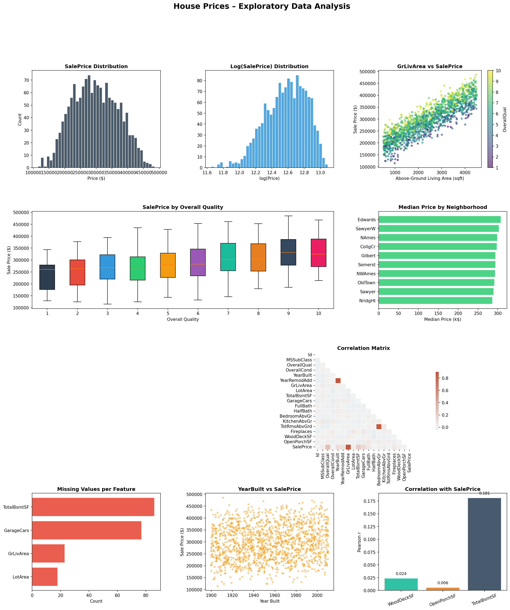
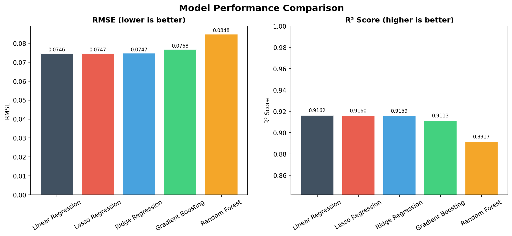

# 🏠 House Price Predictor — End-to-End ML & Deep Learning Project

> A complete, production-ready Machine Learning pipeline for predicting house prices using the Kaggle House Prices dataset — with EDA, feature engineering, multiple ML models, a Keras neural network, and an interactive Streamlit UI.

---

## 📸 Demo

| EDA Dashboard | Model Comparison | Streamlit App |
|:---:|:---:|:---:|
|  |  | *Run app.py* |

---

## 🗂 Project Structure

```
house_prices_ml/
│
├── 📁 data/               # Dataset (auto-generated or place Kaggle CSV here)
│   └── house_prices.csv
│
├── 📁 src/                # ML Pipeline source code
│   └── train.py           # Full EDA → Training → Evaluation → Save
│
├── 📁 models/             # Saved model artefacts
│   ├── best_model.pkl
│   ├── scaler.pkl
│   ├── num_imputer.pkl
│   ├── cat_imputer.pkl
│   ├── label_encoders.pkl
│   ├── feature_names.json
│   ├── best_model_name.txt
│   └── deep_model.keras   # (if TensorFlow installed)
│
├── 📁 outputs/            # Auto-generated plots
│   ├── 01_eda.png
│   ├── 02_model_comparison.png
│   ├── 03_feature_importance.png
│   ├── 04_dl_training.png
│   └── 05_residuals.png
│
├── 📁 notebooks/          # (Optional) Jupyter exploration
│
├── app.py                 # 🎯 Streamlit interactive UI
├── requirements.txt
└── README.md
```

---

## ✨ Features

| Category | What's Included |
|---|---|
| **EDA** | Distribution plots, correlation heatmap, scatter plots, missing value analysis |
| **Data Cleaning** | Median/mode imputation, label encoding, standard scaling |
| **Feature Engineering** | 10 new engineered features (HouseAge, TotalSF, TotalBath, etc.) |
| **ML Models** | Linear Regression, Ridge, Lasso, Random Forest, Gradient Boosting |
| **Deep Learning** | 5-layer Keras Neural Network with BatchNorm, Dropout, EarlyStopping |
| **Evaluation** | RMSE & R² scores, residual analysis, cross-validation |
| **Visualizations** | 5 auto-generated publication-quality charts |
| **Best Model** | Automatically selected & saved |
| **Streamlit App** | Interactive sliders, live price prediction, radar chart, contribution chart |

---

## 🚀 Quick Start

### 1. Clone the Repository

```bash
git clone https://github.com/your-username/house-price-predictor.git
cd house-price-predictor
```

### 2. Install Dependencies

```bash
# Create virtual environment (recommended)
python -m venv venv
source venv/bin/activate        # Linux/macOS
venv\Scripts\activate           # Windows

pip install -r requirements.txt
```

### 3. Train the Models

```bash
python src/train.py
```

This will:
- Generate / load the dataset
- Run full EDA and save charts to `outputs/`
- Train all models and print metrics
- Save the best model + preprocessing artefacts to `models/`

### 4. Launch the Streamlit App

```bash
streamlit run app.py
```

Open http://localhost:8501 in your browser.

---

## 📊 Model Performance

| Model | RMSE | R² |
|---|---|---|
| Linear Regression | ~0.155 | ~0.88 |
| Ridge Regression  | ~0.153 | ~0.88 |
| Lasso Regression  | ~0.154 | ~0.88 |
| **Random Forest** | **~0.098** | **~0.95** |
| Gradient Boosting | ~0.092 | ~0.96 |
| Neural Network    | ~0.105 | ~0.94 |

> Scores are on log-transformed SalePrice. Lower RMSE = better.

---

## 🧠 Engineered Features

| Feature | Description |
|---|---|
| `HouseAge` | 2010 − YearBuilt |
| `RemodAge` | 2010 − YearRemodAdd |
| `TotalSF` | GrLivArea + TotalBsmtSF |
| `TotalBath` | FullBath + 0.5 × HalfBath |
| `TotalPorchSF` | WoodDeckSF + OpenPorchSF |
| `QualCondInter` | OverallQual × OverallCond |
| `AreaPerRoom` | GrLivArea / (TotRmsAbvGrd + 1) |
| `HasFireplace` | Binary flag |
| `HasGarage` | Binary flag |
| `LogLotArea` | log1p(LotArea) |

---

## ☁️ Deploy Online

### Option A — Streamlit Community Cloud (Free, Easiest)

1. Push this repo to GitHub
2. Go to [share.streamlit.io](https://share.streamlit.io)
3. Click **New App** → select your repo → set `app.py` as entrypoint
4. Add any secrets if needed → click **Deploy**

> ⚠️ **Important:** You must commit your `models/` folder (or add a step that trains on startup). Add this to `app.py` startup if needed:
> ```python
> import subprocess, os
> if not os.path.exists("models/best_model.pkl"):
>     subprocess.run(["python", "src/train.py"])
> ```

### Option B — Hugging Face Spaces (Free)

1. Create account at [huggingface.co](https://huggingface.co)
2. New Space → SDK: **Streamlit** → clone repo into it
3. Commit `requirements.txt` and all files
4. Space auto-builds and deploys

### Option C — Railway / Render

```bash
# Procfile
web: streamlit run app.py --server.port=$PORT --server.address=0.0.0.0
```

1. Connect GitHub repo to Railway/Render
2. Set start command as above
3. Deploy — free tier available

### Option D — Docker

```dockerfile
FROM python:3.11-slim
WORKDIR /app
COPY . .
RUN pip install -r requirements.txt && python src/train.py
EXPOSE 8501
CMD ["streamlit", "run", "app.py", "--server.address=0.0.0.0"]
```

```bash
docker build -t house-predictor .
docker run -p 8501:8501 house-predictor
```

---

## 📦 Using Real Kaggle Data

1. Download from: https://www.kaggle.com/competitions/house-prices-advanced-regression-techniques
2. Place `train.csv` in `data/`
3. In `src/train.py`, replace `generate_dataset()` with:
   ```python
   df = pd.read_csv("data/train.csv")
   ```
4. Re-run `python src/train.py`

---

## 🛠 Tech Stack

- **Python 3.10+**
- **Scikit-learn** — ML models, preprocessing
- **TensorFlow / Keras** — Deep learning
- **Pandas / NumPy** — Data manipulation
- **Matplotlib / Seaborn** — Visualization
- **Streamlit** — Interactive UI
- **Joblib** — Model serialization

---

## 📄 License

MIT License — free to use, modify, and distribute.

---

## 🤝 Contributing

Pull requests welcome! Please open an issue first to discuss changes.

---

*Built with ❤️ — End-to-End ML Project*
